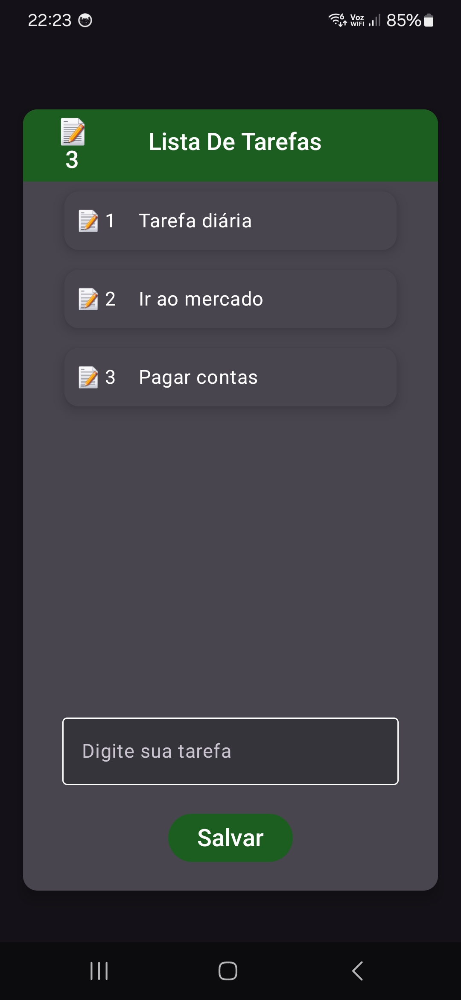
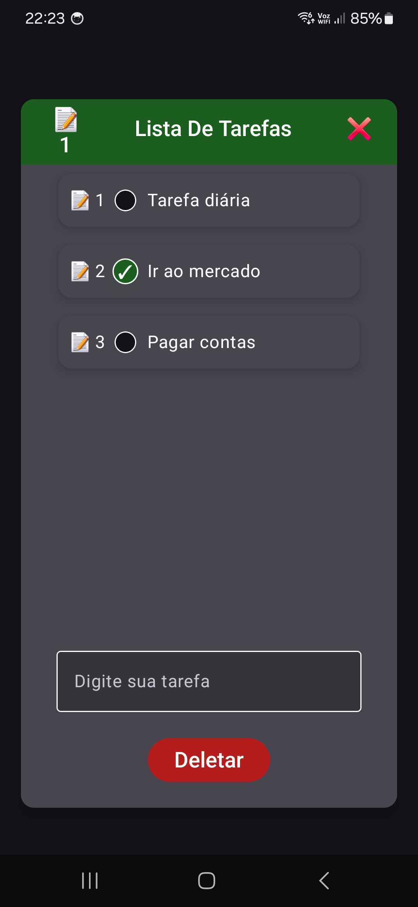

# 📋 Lista de Tarefas - Jetpack Compose

Aplicativo de gerenciamento de tarefas simples e elegante desenvolvido com **Jetpack Compose**, **Room** e **Kotlin**. Permite criar, editar, marcar, deletar e compartilhar tarefas via WhatsApp.

---

## ✨ Funcionalidades

- ✅ Adicionar nova tarefa
- ✏️ Editar tarefas existentes
- 🗑️ Selecionar e deletar múltiplas tarefas
- ✅ Marcar tarefas para exclusão com checkbox animados
- 📲 Compartilhar tarefas diretamente no WhatsApp
- 💾 Persistência local com Room Database
- 🎨 Interface animada com Jetpack Compose

---

## 🖼️ Interface do Usuário

| Visualização Principal         | Editor de Tarefa               | Compartilhar no WhatsApp         |
| ------------------------------ | ------------------------------ | -------------------------------- |
|  |  |  |

---

## 🏗️ Arquitetura

- **Jetpack Compose** para UI declarativa
- **Room** para persistência local
- **State Management** via `remember`, `mutableStateOf` e `mutableStateListOf`
- **Hooks-like Pattern** com `taskHook()` para organizar lógica de UI
- **Responsividade** e animações com `animate*AsState`, `AnimatedVisibility`, `LazyColumn`, entre outros

---

## 🛠️ Tecnologias Utilizadas

- [Kotlin](https://kotlinlang.org/)
- [Jetpack Compose](https://developer.android.com/jetpack/compose)
- [Room Persistence Library](https://developer.android.com/jetpack/androidx/releases/room)
- [Material 3](https://developer.android.com/jetpack/androidx/releases/compose-material3)

---

## ▶️ Como Rodar

1. Clone o projeto:
   ```bash
   git clone https://github.com/MaiconMJS/lista-de-tarefas-android.git
   ```
